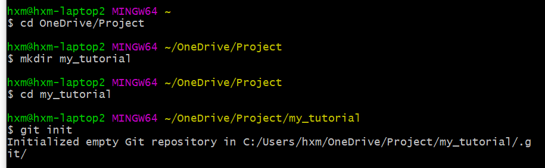
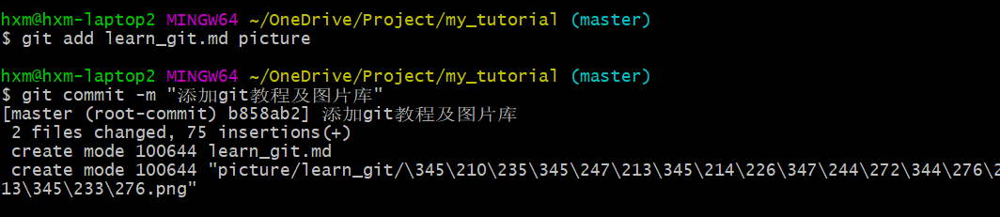
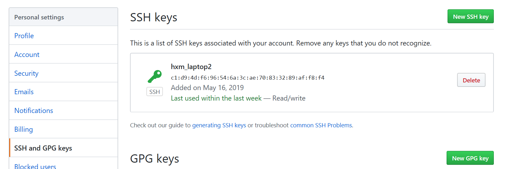
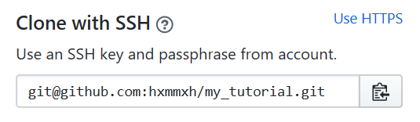
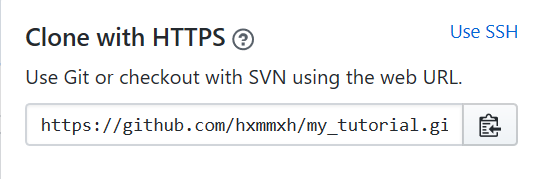

README
=======

本文参考[廖雪峰Git教程](https://www.liaoxuefeng.com/wiki/896043488029600)  
根据自己的理解进行了总结归纳

# 目录
1. [本地操作](#本地操作)  
	1. [初始化](#初始化)
	2. [添加文件](#添加文件)
	3. [状态查看](#状态查看)
2. [远程操作](#远程操作)
	1. 绑定github


## 本地操作

### 初始化 
* 新建一个目录
* 在Git Bash中进入该目录，使用git init命令  
* 创建成功后在当前目录下会多了一个默认隐藏的.git目录，Git用它来跟踪管理版本库  

### 添加文件
添加文件到Git仓库，分两步：
1. 使用命令git add \<file>，注意，可反复多次使用，添加多个文件
2. 使用命令git commit -m \<message>，把文件提交到仓库

-m后面输入的是本次提交的说明，可以输入任意内容，当然最好是有意义的，这样你就能从历史记录里方便地找到改动记录。  
[git commit常见用法](https://blog.csdn.net/qianxuedegushi/article/details/80311358)  


### 状态查看
git status命令
```
有文件被修改  
On branch master  
Changes not staged for commit:  
  (use "git add <file>..." to update what will be committed)  
  (use "git checkout -- <file>..." to discard changes in working directory)    
                    modified:README.md  
no changes added to commit (use "git add" and/or "git commit -a")
```
```
有文件已被add，但未被commit
On branch master
Changes to be committed:
 (use "git reset HEAD <file>..." to unstage)

                    modified:README.md
```
```
正常状态  
On branch master  
nothing to commit, working tree clean
```
### 查看是否有区别
git diff命令
### 提交修改后的文件

# 远程操作

### 绑定github
1. 在用户主目录下，查看是否有.ssh目录，如果有，再看看这个目录下有没有id_rsa和id_rsa.pub这两个文件，如果有，跳到第3步，如果没有，到第2步
2. 打开Shell（Windows下打开Git Bash），创建SSH Key  
    `$ ssh-keygen -t rsa -C "youremail@example.com"`  
	把邮件地址换成自己的邮件地址，然后一路回车，使用默认值即可
	一切顺利的话，可以在用户主目录里找到.ssh目录，里面有id_rsa和id_rsa.pub两个文件，这两个就是SSH Key的秘钥对，id_rsa是私钥，不能泄露出去，id_rsa.pub是公钥，可以放心地告诉任何人。
3. 登陆GitHub，打开“Account settings”，“SSH Keys”页面：
然后，点“Add SSH Key”，填上任意Title，在Key文本框里粘贴id_rsa.pub文件的内容，最后点“Add Key”。一切完成的状态如下图所示

4. 为什么GitHub需要SSH Key呢？因为GitHub需要识别出你推送的提交确实是你推送的，而不是别人冒充的，而Git支持SSH协议，所以，GitHub只要知道了你的公钥，就可以确认只有你自己才能推送。
当然，GitHub允许你添加多个Key。假定你有若干电脑，你一会儿在公司提交，一会儿在家里提交，只要把每台电脑的Key都添加到GitHub，就可以在每台电脑上往GitHub推送了。
### 把本地库和github相连
1. 在github上新建一个库
2. 获取该库的地址，有两种格式，ssh和https,用哪种都可以


3. 关联远程库：在Git Bash中输入指令`git remote add origin 第2步中获得的地址`
4. 把本地库的内容推送到远程 `git push -u origin master`  
由于远程库是空的，我们第一次推送master分支时，加上了-u参数，Git不但会把本地的master分支内容推送的远程新的master分支，还会把本地的master分支和远程的master分支关联起来，在以后的推送或者拉取时就可以简化命令。
5. 此后，只要在本地库进行了修改，就可以通过命令`git push origin master`把本地master分支的最新修改推送至GitHub
```

# vscode集成git操作
