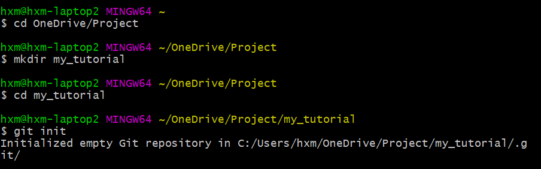

README
=======

本文参考[廖雪峰Git教程](https://www.liaoxuefeng.com/wiki/896043488029600)  
根据自己的理解进行了总结归纳

# 目录
1. [本地操作](#本地操作)
2. [远程操作](#远程操作)


## 本地操作

### 初始化 
* 新建一个目录
* 在Git Bash中进入该目录，使用git init命令  
* 创建成功后在当前目录下会多了一个默认隐藏的.git目录，Git用它来跟踪管理版本库  

### 添加文件
添加文件到Git仓库，分两步：
1. 使用命令git add \<file>，注意，可反复多次使用，添加多个文件；  
2. 使用命令git commit -m \<message>，完成。

-m后面输入的是本次提交的说明，可以输入任意内容，当然最好是有意义的，这样你就能从历史记录里方便地找到改动记录。  
[git commit常见用法](https://blog.csdn.net/qianxuedegushi/article/details/80311358)
#### 查看git库状态
git status命令
```
有文件被修改  
On branch master  
Changes not staged for commit:  
  (use "git add <file>..." to update what will be committed)  
  (use "git checkout -- <file>..." to discard changes in working directory)    
                    modified:README.md  
no changes added to commit (use "git add" and/or "git commit -a")
```
```
有文件已被add，但未被commit
On branch master
Changes to be committed:
 (use "git reset HEAD <file>..." to unstage)

                    modified:README.md
```
```
正常状态  
On branch master  
nothing to commit, working tree clean
```
### 查看是否有区别
git diff命令
### 提交修改后的文件

# 远程操作
### 把本地库和github相连
```
新建一个并加入
echo "# learn_git" >> README.md
git init
git add README.md
git commit -m "first commit"
git remote add origin https://github.com/hxmmxh/learn_git.git
地址有两种格式，这是https格式，下一个是ssh格式
git remote add origin git@github.com:hxmmxh/my_readme.git
git push -u origin master
```

```
加入已有库
git remote add origin https://github.com/hxmmxh/learn_git.git
git push -u origin master
```

# vscode集成git操作
